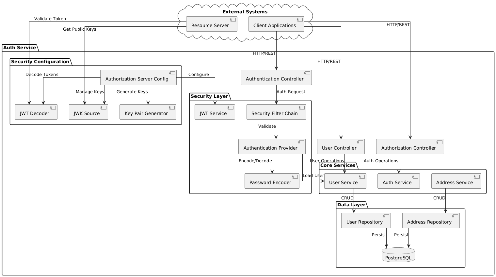
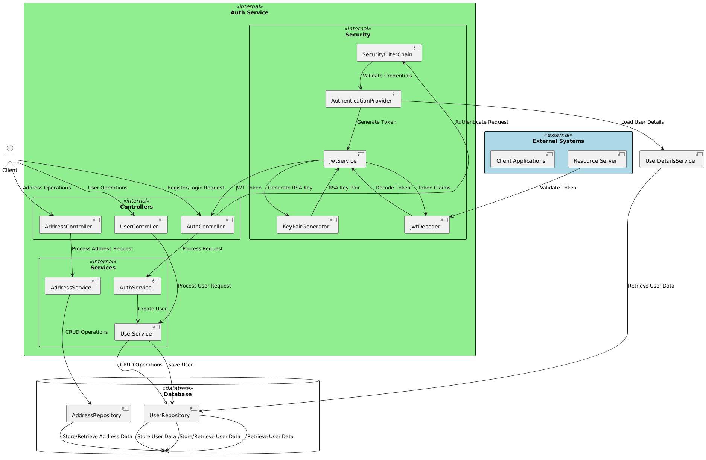
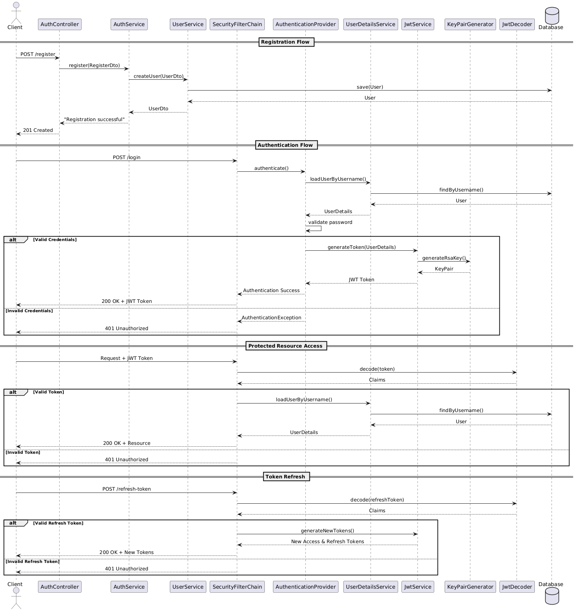
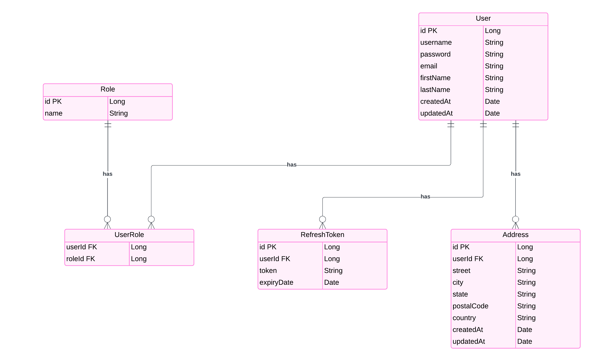
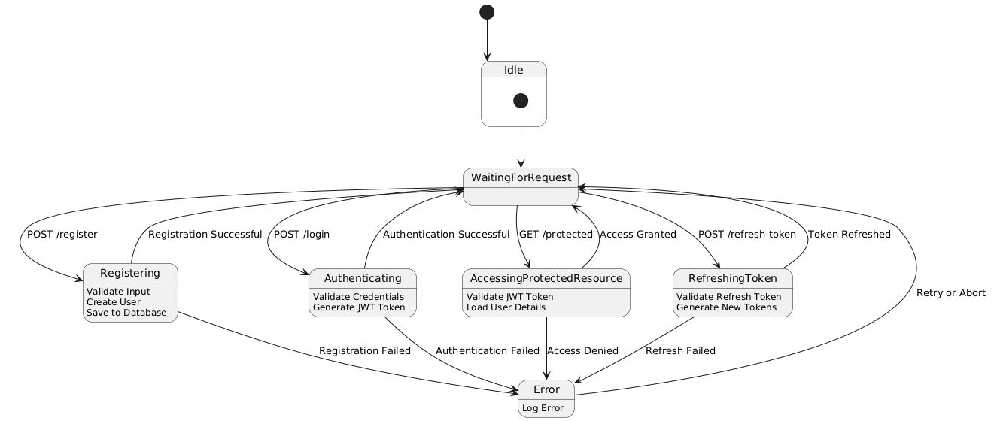

# Dự án Auth Service

Dự án Auth Service cung cấp dịch vụ xác thực (authentication) cho các ứng dụng khác trong hệ thống. Dịch vụ này được xây dựng dựa trên Spring Boot, Spring Security và OAuth 2.0.

## Kiến trúc

### Architecture Diagram

Sơ đồ này mô tả tổng quan kiến trúc của hệ thống, bao gồm các thành phần chính như Client Application, Auth Service, Resource Server và Database. Client Application sử dụng Auth Service để lấy access token, sau đó sử dụng access token này để truy cập tài nguyên được bảo vệ bởi Resource Server.

### Data Flow Diagram (DFD)

Sơ đồ DFD minh họa luồng dữ liệu trong quá trình xác thực.  Client gửi yêu cầu xác thực đến Auth Service, Auth Service kiểm tra thông tin đăng nhập và trả về access token nếu xác thực thành công.

### Sequence Diagram

Sơ đồ này mô tả chi tiết luồng xử lý của quá trình xác thực, bao gồm cả đăng ký người dùng và lấy access token.  Nó thể hiện sự tương tác giữa các thành phần trong hệ thống như Client, Auth Service, Database, và các thành phần khác.

## Thiết kế Cơ sở dữ liệu

### Entity Relationship Diagram (ERD)

Sơ đồ ERD mô tả các bảng trong cơ sở dữ liệu và mối quan hệ giữa chúng.  Các bảng chính bao gồm `users`, `roles`, và `address`.

## Trạng thái

### State Diagram

Sơ đồ trạng thái mô tả các trạng thái của người dùng trong quá trình xác thực (ví dụ: chưa đăng nhập, đang đăng nhập, đăng nhập thành công, đăng nhập thất bại).

## Công nghệ sử dụng

* Java
* Spring Boot
* Spring Security
* OAuth 2.0
* MySQL
* ...

## Hướng dẫn sử dụng

1. Clone repository từ GitHub.
2. Cấu hình database trong `application.properties`.
3. Chạy ứng dụng `AuthServiceApplication`.
4. Sử dụng API `/register` hoặc `/signup` để đăng ký người dùng mới.
5. Sử dụng API `/oauth2/v1/token` để lấy access token.

## Thông tin liên hệ

* **Tác giả:** Phan Lê Nhật Anh
* **Email:** anhphanler@gmail.com
* **GitHub:** https://github.com/anhphanler